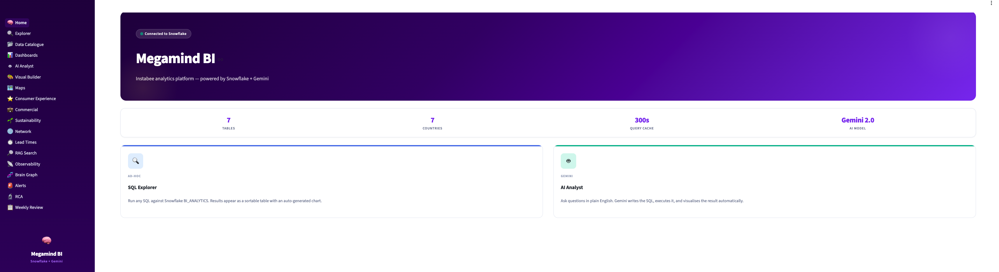
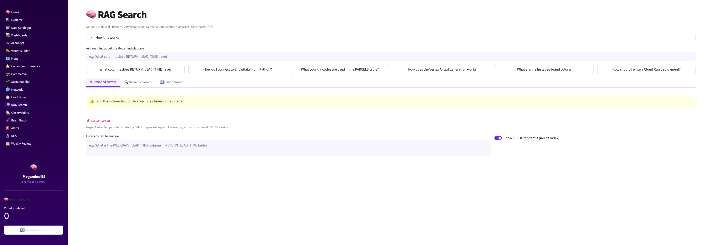
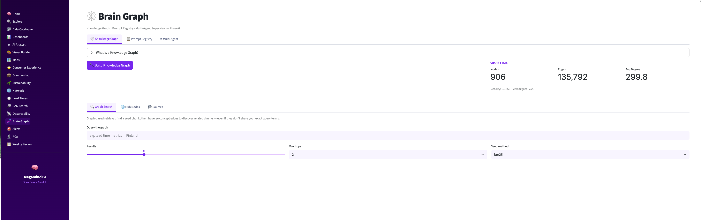
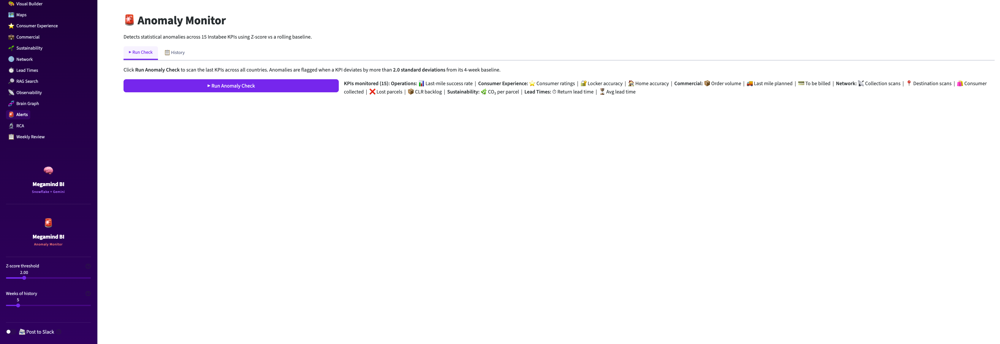

# Hey, I'm @theabsurdisst

Building AI-powered data tools that turn raw warehouse data into decisions.

---

## 🧠 Megamind BI

> Personal AI analytics platform — natural language to SQL, hybrid RAG search, knowledge graphs, anomaly detection, and LLMOps. Built on Snowflake + Gemini + LangGraph, deployed on GCP Cloud Run.

<table>
<tr>
<td width="50%"> <b>Home</b> — live Snowflake connection, quick-launch cards</td>
<td width="50%"> <b>RAG Search</b> — semantic + BM25 hybrid retrieval with query expansion</td>
</tr>
<tr>
<td width="50%"> <b>Brain Graph</b> — 906 nodes · 135,792 edges</td>
<td width="50%"> <b>Anomaly Monitor</b> — Z-score detection across 15 KPIs</td>
</tr>
</table>

### What's inside

| | |
|---|---|
| **AI Analyst** | Ask questions in plain English — Gemini writes SQL, runs it, charts the result. Two-agent LangGraph pipeline (context mapper → SQL builder) to eliminate hallucinations |
| **RAG Search** | Semantic + BM25 hybrid retrieval over a knowledge base. Query expansion, reranking, conversation memory |
| **Brain Graph** | Knowledge graph with 900+ nodes and 135k+ edges. Graph-based retrieval across concept edges |
| **Anomaly Monitor** | Z-score detection across 15 KPIs vs rolling 4-week baseline. Slack alerts |
| **Observability** | Every LLM call logged — latency, token cost, feedback, cache hit rate |
| **RCA** | Root cause analysis agent — multi-step plan→investigate→synthesise pipeline |
| **LLMOps** | Prompt versioning, A/B testing, auto-promotion based on metrics |
| **+ 14 more** | Explorer, Dashboards, Maps, Visual Builder, Weekly Review, Data Quality… |

### Stack

**AI & Agents**
`LangGraph` `LangChain` `Gemini 2.0 Flash` `Vertex AI` `ChromaDB` `BM25` `networkx`

**Data**
`Snowflake` `dbt` `pandas` `numpy` `scipy`

**Frontend**
`Streamlit` `React` `Vite` `TypeScript` `Tailwind CSS` `Plotly` `pydeck / deck.gl`

**Backend & APIs**
`FastAPI` `uvicorn` `Python 3.11` `SQLite`

**Infra & Cloud**
`GCP Cloud Run` `Cloud Build` `Vertex AI` `GCP Secret Manager` `Google Cloud Storage`

**Integrations**
`Slack (Bolt SDK)` `Google Drive / Sheets / Slides API` `gspread`

---

*Building in public — one absurd idea at a time.*
